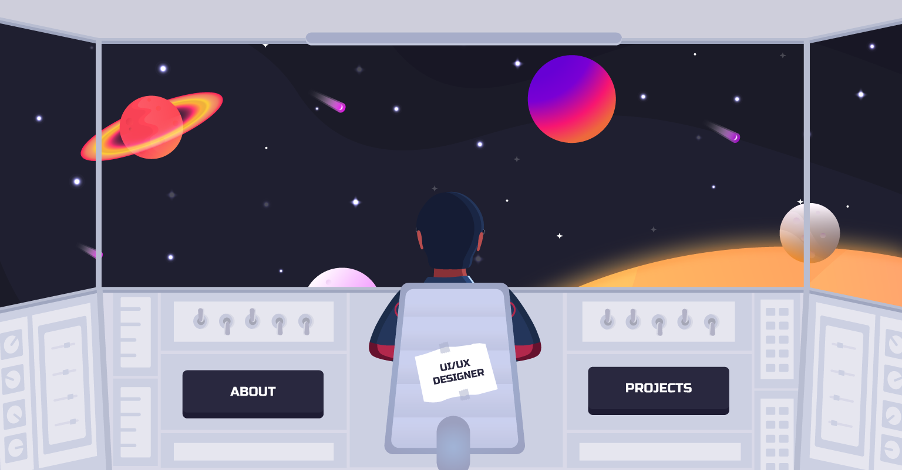

# Portfolio project

Creating an interactive portfolio website. The concept of space is used as a metaphor for challenges and unknowns and the astronaut who is ready to delve into those challenges. The planets refer to different projects of mine. Currently they send to an error page as the project details page are still in development.

The homepage animations responds to mouse position.

The homepage has 2 links, projects and about. Clicking on the about button pulls up a screen to show some information about me. Project buttons zooms into the space in which the user can navigate using mouse. Currently working on adding more details to the Projects page.

Find the live version at https://pranjal-deep.github.io/Pranjal-Portfolio/.

Built using P5 Play library.

